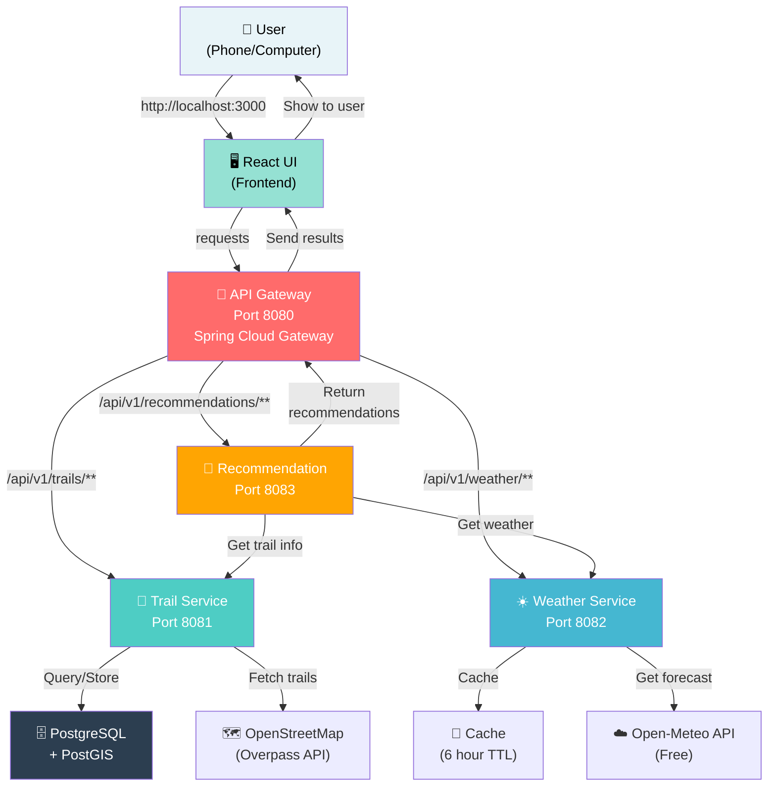
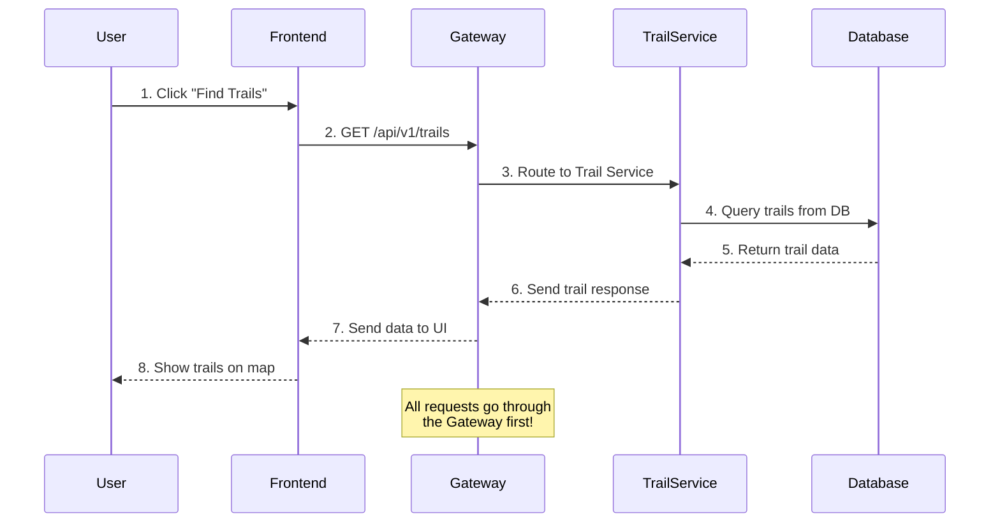

# TrailEquip Architecture Diagrams

## 🎨 Visual Architecture

### Complete System Diagram



---

## 🔄 Data Flow Diagram

### How a Request Gets Processed



---

## 📍 Port Mapping

### What Each Port Does

```
┌────────────────────────────────────────────────────────┐
│                    YOUR COMPUTER                        │
├────────────────────────────────────────────────────────┤
│                                                         │
│  Port 8080 ▶️ API GATEWAY (Frontend talks here)       │
│  ├─ /swagger-ui.html (API docs)                       │
│  ├─ /actuator/health (health check)                   │
│  └─ /actuator/metrics (performance stats)             │
│                                                         │
│  Port 8081 ▶️ TRAIL SERVICE (Trail stuff)             │
│  ├─ POST /trails/ingest (add trails)                  │
│  ├─ GET /trails (list all)                            │
│  ├─ GET /trails/{id}/geojson (download for map)       │
│  └─ GET /trails/{id}/gpx (download for GPS)           │
│                                                         │
│  Port 8082 ▶️ WEATHER SERVICE (Weather stuff)         │
│  ├─ GET /weather/forecast (get forecast)              │
│  └─ GET /weather/providers (list providers)           │
│                                                         │
│  Port 8083 ▶️ RECOMMENDATION SERVICE (Packing advice) │
│  └─ POST /recommendations/equipment (what to pack)    │
│                                                         │
│  Port 5432 ▶️ DATABASE (Storage)                       │
│  └─ Stores all trail info (internal only)             │
│                                                         │
│  Port 3000 ▶️ FRONTEND (User interface)                │
│  └─ React app (what you see in browser)               │
│                                                         │
└────────────────────────────────────────────────────────┘
```

---

## 🎯 Service Responsibilities

### Trail Service (8081) - "Trail Expert"

```
INPUTS:
├─ User requests: "Show me trails"
├─ OpenStreetMap: Trail data
└─ Database: Stored trails

PROCESSES:
├─ Search trails
├─ Grade difficulty
├─ Classify terrain
├─ Identify hazards
└─ Export formats

OUTPUTS:
├─ JSON trail data
├─ GeoJSON (for maps)
└─ GPX files (for GPS)
```

### Weather Service (8082) - "Weather Expert"

```
INPUTS:
├─ User requests: "Weather forecast?"
├─ Open-Meteo API: Weather data
└─ Cache: Previously fetched data

PROCESSES:
├─ Get forecast
├─ Parse weather data
├─ Store in cache (6 hours)
└─ Return formatted response

OUTPUTS:
├─ Temperature, rain, wind
├─ Timezone-aware times
└─ Cache metadata
```

### Recommendation Service (8083) - "Packing Expert"

```
INPUTS:
├─ User: Trail ID + dates
├─ Trail Service: Trail difficulty & terrain
└─ Weather Service: Forecast data

PROCESSES:
├─ Analyze temperature
├─ Check precipitation
├─ Evaluate wind
├─ Map to equipment
└─ Generate warnings

OUTPUTS:
├─ Equipment list (categorized)
├─ Safety warnings
└─ Packing strategy
```

---

## 🔌 Connections Map

### Who Talks to Whom

```
┌─────────────────────────────────────────────────────┐
│                  SERVICES                           │
├─────────────────────────────────────────────────────┤
│                                                     │
│  API Gateway (8080)                                │
│  ├─→ Trail Service (8081)          [Direct route]  │
│  ├─→ Weather Service (8082)        [Direct route]  │
│  └─→ Recommendation Service (8083) [Direct route]  │
│                                                     │
│  Trail Service (8081)                              │
│  ├─→ PostgreSQL Database           [Store/fetch]   │
│  ├─→ OpenStreetMap Overpass API    [Fetch trails]  │
│  └─← Recommendation Service        [Request info]  │
│                                                     │
│  Weather Service (8082)                            │
│  ├─→ Open-Meteo API                [Fetch weather] │
│  ├─→ Cache/Memory                  [6-hour cache]  │
│  └─← Recommendation Service        [Request info]  │
│                                                     │
│  Recommendation Service (8083)                     │
│  ├─→ Trail Service (8081)          [Get trail info]│
│  ├─→ Weather Service (8082)        [Get forecast]  │
│  └─→ Internal Logic                [Calculate]     │
│                                                     │
└─────────────────────────────────────────────────────┘
```

---

## 📊 Request Journey Map

### "What gear should I pack for Omu Peak tomorrow?"

```
┌─────────────────────────────────────────────────────┐
│ STEP 1: You Click "Get Recommendations"             │
│ Browser sends: http://localhost:8080/...            │
└──────────────────┬──────────────────────────────────┘
                   │
┌──────────────────▼──────────────────────────────────┐
│ STEP 2: API Gateway (8080) receives request         │
│ Gateway: "OK, send this to Recommendation Service"  │
└──────────────────┬──────────────────────────────────┘
                   │
┌──────────────────▼──────────────────────────────────┐
│ STEP 3: Recommendation Service (8083) starts work   │
│ Needs: Trail info + Weather forecast                │
└──────────────────┬──────────────────────────────────┘
                   │
        ┌──────────┴──────────┐
        │                     │
┌───────▼─────────┐   ┌──────▼──────────┐
│ STEP 4a:        │   │ STEP 4b:        │
│ Call Trail Svc  │   │ Call Weather Svc│
│ (Port 8081)     │   │ (Port 8082)     │
│ "What is Omu    │   │ "What's weather │
│  Peak?"         │   │  tomorrow?"     │
└───────┬─────────┘   └──────┬──────────┘
        │                    │
        │ Returns:           │ Returns:
        │ "HARD trail,       │ "5°C, 60%
        │  1200m elevation,  │  rain,
        │  exposed,          │  30 km/h
        │  rocky"            │  wind"
        │                    │
└───────┬────────────────────┘
        │
┌───────▼──────────────────────────────────────────────┐
│ STEP 5: Recommendation Logic Combines Data           │
│                                                      │
│ HARD trail + Cold + Rainy + Windy                   │
│                                                      │
│ = Thermal layer + Rain jacket + Microspikes         │
│   + Warnings: "High wind on ridges"                 │
└───────┬──────────────────────────────────────────────┘
        │
┌───────▼──────────────────────────────────────────────┐
│ STEP 6: Send Results Back Through Gateway           │
│ Gateway sends JSON response to browser              │
└───────┬──────────────────────────────────────────────┘
        │
┌───────▼──────────────────────────────────────────────┐
│ STEP 7: Browser Shows You the Results               │
│ ✓ Thermal base layer                                │
│ ✓ Rain jacket                                       │
│ ✓ Microspikes                                       │
│ ⚠️ Warning: High wind on ridges                     │
└────────────────────────────────────────────────────┘
```

---

## 🧮 Architecture Layers

### How Data Flows Through Each Service

```
┌──────────────────────────────────────────────────────┐
│ CLIENT LAYER (Your Phone/Computer)                   │
│ React App - Shows data to user                       │
└──────────────────┬───────────────────────────────────┘
                   │
┌──────────────────▼───────────────────────────────────┐
│ API GATEWAY LAYER (Port 8080)                        │
│ Routes requests to correct service                   │
└──────────────────┬───────────────────────────────────┘
                   │
        ┌──────────┼──────────┐
        │          │          │
┌───────▼──┐ ┌────▼──────┐ ┌─▼────────┐
│ ADAPTER  │ │ ADAPTER   │ │ ADAPTER  │
│ (REST    │ │ (REST     │ │ (REST    │
│ API)     │ │ API)      │ │ API)     │
└───────┬──┘ └────┬──────┘ └─┬────────┘
        │         │         │
┌───────▼────┐ ┌──▼──────┐ ┌▼─────────┐
│APPLICATION │ │ APPLIC. │ │APPLIC.   │
│SERVICE     │ │ SERVICE │ │ SERVICE  │
│(Business   │ │(Business│ │(Business │
│Logic)      │ │Logic)   │ │ Logic)   │
└───────┬────┘ └──┬──────┘ └┼─────────┘
        │         │        │
┌───────▼──────┐ ┌▼─────┐ └→DATABASE
│DOMAIN LAYER  │ │CACHE │  │
│(Core Logic)  │ └──────┘  │
└───────┬──────┘           │
        │                  │
┌───────▼──────────────────▼──────────┐
│ INFRASTRUCTURE LAYER                 │
│ ├─ PostgreSQL Database               │
│ ├─ External APIs (OSM, Open-Meteo)   │
│ └─ Cache Storage                     │
└──────────────────────────────────────┘
```

---

## 🎓 Quick Reference

### Ports at a Glance

| Port | Service | Purpose | Language |
|------|---------|---------|----------|
| **3000** | React UI | What you see | JavaScript/React |
| **8080** | API Gateway | Main entrance | Java/Spring |
| **8081** | Trail Service | Trail CRUD | Java/Spring |
| **8082** | Weather Service | Weather data | Java/Spring |
| **8083** | Recommendation | Equipment advice | Java/Spring |
| **5432** | PostgreSQL | Data storage | SQL |

---

## 🚀 How to Remember This

**Imagine a phone number:**
- **3000** = Your app's number (call to use it)
- **8080** = Receptionist (answer questions, route calls)
- **8081** = Trail department (knows about trails)
- **8082** = Weather department (knows about weather)
- **8083** = Packing department (knows what to pack)
- **5432** = Filing cabinet (stores everything)

**They all work together to help you plan hikes!** 🥾🎒☀️

---

## 📚 More Information

For more details about each service, see:
- [ARCHITECTURE.md](ARCHITECTURE.md) - Complete technical details
- [API_REFERENCE.md](API_REFERENCE.md) - All endpoints with examples
- [ARCHITECTURE_SIMPLE.md](ARCHITECTURE_SIMPLE.md) - Easy explanation
